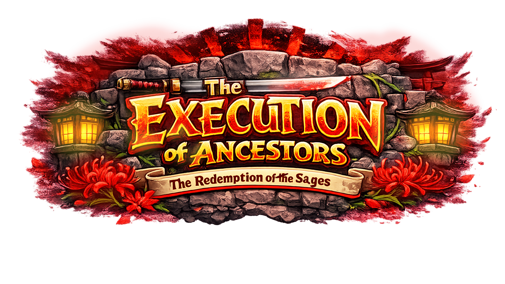
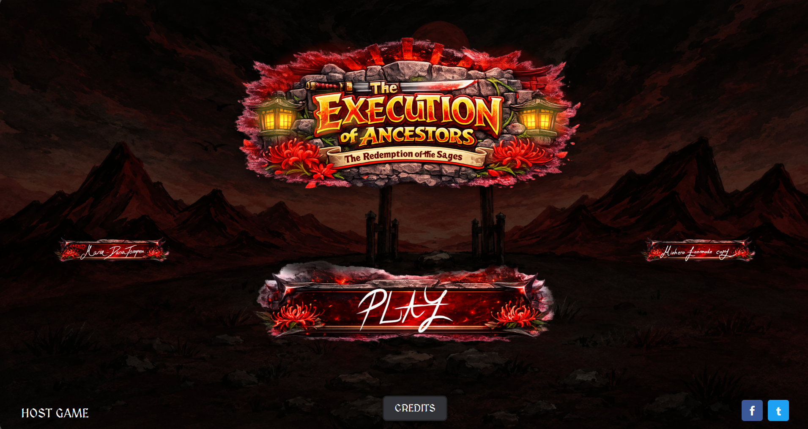
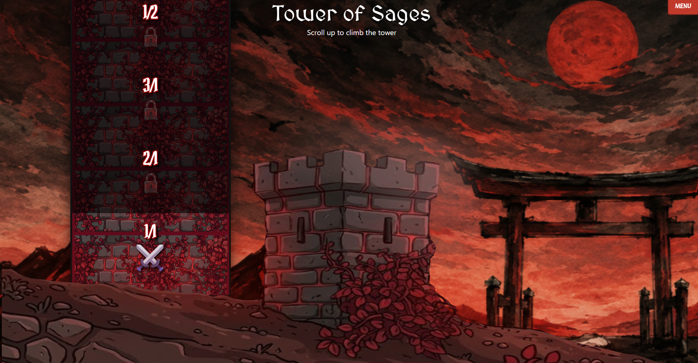
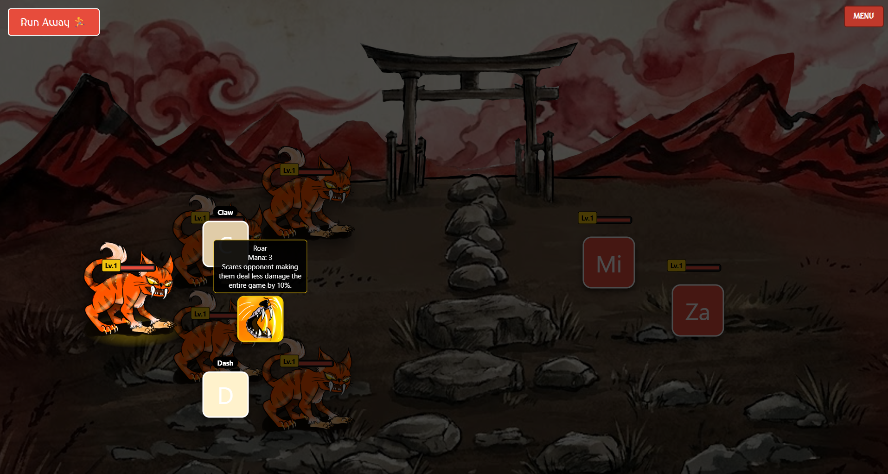
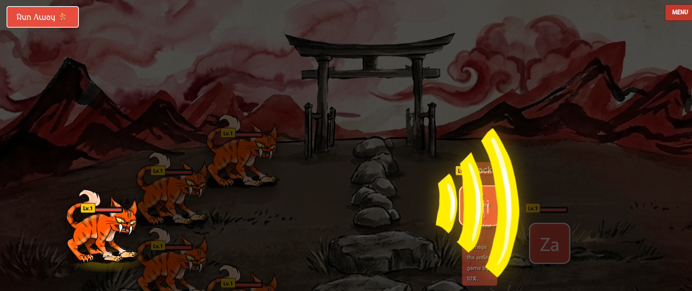

  

# MinHero: Tower of Sages (Revamped)

Welcome to **MinHero: Tower of Sages**, a browser-based strategic RPG where you collect, train, and battle elemental creatures! 

This project is a modern, web-based revamp of the classic MinHero experience. It runs entirely in your browser using raw HTML, CSS, and vanilla JavaScript—no complex build tools or local servers required!

---

## 📸 Features & Gallery

### The Main Hub
When you load into the game, you are greeted by the beautifully animated Main Hub where you can view your current collection of Minions and check out your active Army.

### The Tower
Challenge the Tower of Sages! Fight your way through procedurally generated levels and conquer fierce bosses to prove your mastery.

### Dynamic Combat & Arena
Enter the arena and engage in strategic turn-based combat. Each Minion has unique stats, abilities, and elemental affinities.

### Elemental Mechanics & Abilities
Combat is driven by an elemental weakness and resistance system! Is your opponent weak to your ability? You'll deal **Super Effective** damage! 

---

## 🛠️ How It Works (Engine Features)

The game features a custom data-driven engine that reads character files directly from the folder structure. 

To add a new Minion or Ability to the game, you don't even need to write JavaScript! Just create a folder and text file:
* **Stats (`stats.txt`)**: Define the `HEALTH`, `ENERGY`, `SPEED`, and `ATTACK` for any minion. Add an exclamation point (`!ATTACK`) to mark a stat as their primary scaling stat!
* **Elements (`element.txt`)**: Simply write `FIRE`, `WATER`, `EARTH`, or `NORMAL` inside a text file in the minion's folder to assign their elemental typing.
* **Abilities (`description.txt`)**: Give your ability a mana cost, base `DAMAGE: 20`, and an `ELEMENT: FIRE`. The game reads this text file and automatically applies the math in combat!

## 🚀 How to Play

Because the game is built entirely with vanilla web technologies, playing it is incredibly easy:
1. Clone or download this repository.
2. Double-click on `index.html` to open it in your web browser.
3. Enjoy! (Note: Chrome may block local file `fetch()` requests depending on your security settings. If things don't load, simply run a basic local server using `npx serve` or the Live Server extension in VSCode).

---

*A passion project dedicated to the love of monster-taming RPGs!*
